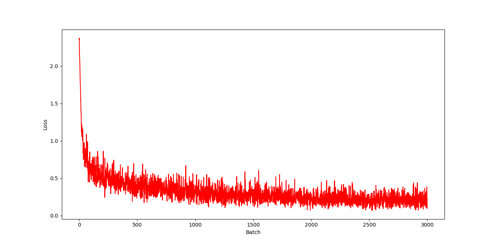
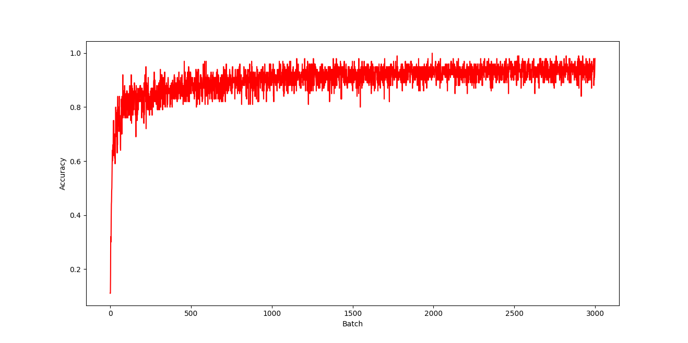

# Tiny NN
This project is a from-scratch implementation of a fully connected neural network written in C++, using Eigen for linear algebra with a great emphasis on model configuration and customisation.

## Network Configuration
The project allows explicit and flexible configuration of neural network architectures directly in code.

### Supported configuration options include:
- Arbitrary number of layers
- Configurable number of neurons per layer
- Explicit layer ordering
- Layer-specific activations
- Adjustable training hyperparameters (learning rate, batch size, epochs)

Network architectures are defined programmatically by constructing and assembling layers, making it straightforward to modify or extend existing configurations.

## Model Saving and Loading
The project supports serialization and deserialization of trained neural networks.

### Saved model data includes:
- Number of layers
- Layer dimensions
- Layer types
- Weight matrices
- Bias vectors

Model loading requires a pre-defined architecture that matches the saved configuration.

## Demo
A model created using the project was trained on the MNIST handwritten digits dataset and achieved a final test accuracy of 93.75%.

### Model stats:
- Layers: 784 (Input) --> 128 --> 64 --> 10 (Output)
- Layer-Specific activations: ReLU (hidden), Softmax (Output)
- Loss: Cross-entropy
- No. of training samples: 60000
- Batch Size: 100
- Learning Rate: 0.5
- No. of Epochs: 5

### Loss-Accuracy per Batch
- Loss per Batch

- Accuracy per Batch

